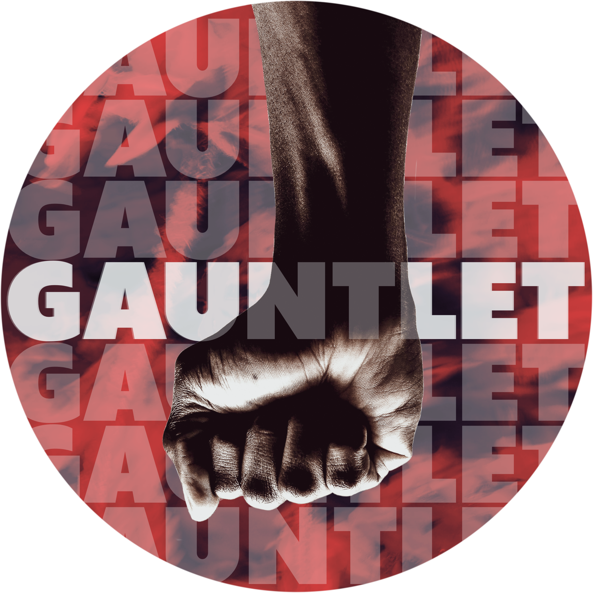

<h1 align="center">gauntletjs</h1>
<h2 align="center">a discord.js mock library for assisting in the development of Discord bots</h2>

  

> To run the gauntlet means to take part in a form of corporal punishment in which the party judged guilty is forced to run between two rows of soldiers, who strike out and attack them with sticks or other weapons. Metaphorically, this expression is also used to convey a public trial that one must overcome.
>--[Wikipedia](https://en.wikipedia.org/wiki/Running_the_gauntlet)  

### INTRODUCTION
gauntlet will serve as a testing grounds for Discord Bot development, hence the name. The intended purpose of this project is to create a library by which Discord bot developers can mock Discord API calls to test features.

This project was originally started by [cherryblossom000](https://github.com/cherryblossom000/)--[discord.js-mock](https://github.com/cherryblossom000/discord.js-mock)--for the purpose of testing Discord bots during their development. The project has since been handed over; **gauntlet** is the effort to build on the original efforts and contribute to the JavaScript Discord development ecosystem.   
  
### WHAT'S CURRENTLY IN THE CODEBASE
This code is haphazardly organized (meaning it isn't organized at all) which allows for some liberties in how to structure the codebase. There's a lot of custom configurations across a number of files and folders that can *probably* (most likely) be cleared out.  
  
For some context, a word from the original creator:
> This was my attempt to create a mocking library for Discord.js. Abandoned for now due to stuff in real life and, to be honest, lack of motivation.
([Context](https://github.com/discordjs/discord.js/discussions/6179))
>
> I’m publishing this code so that it may be useful for someone else. The code is pretty messy and I was in the process of refactoring everything, hence the [`main` branch][main] and the [`old` branch][old] with the old version.
>
> - I initially did a *very* rough version when I subclassed all the discord.js classes and overrode all the methods. This is can be found [in `oldSrc` in the `old` branch](https://github.com/cherryblossom000/discord.js-mock/tree/old/oldSrc).
> - Quickly realising the above was a bad idea, I was refactoring it to override the `Client#api` property instead. I never finished this though. This can be found [in the `old` branch][old].
> - Then I decided to refactor the code again, which is what’s in the [`main` branch][main].
>
>Sorry for the disorganisation and not really following OOP like the rest of the discord.js community tends to do.
>
>If you have any questions about the code or anything else really, feel free to [open a discussion](https://github.com/nonsensetwice/gauntletjs/discussions/new?category=general).

[main]: https://github.com/nonsensetwice/gauntlet/tree/main  
[old]: https://github.com/nonsensetwice/gauntlet/tree/old  
  
### WHERE TO BEGIN
Indeed, where to begin?

First off, read the docs, as outlined below. Second, review the issues. Third, [join the Discord](https://discord.gg/C3NVrrScBv).

- If you have experience as a repository maintainer, your expertise will be helpful in managing issues and PR reviews
- If you have experience in systems design, your expertise will be helpful in restructuring the codebase
- If you have experience with code coverage, your expertise will be useful in reviewing current tests and designing new ones
  
TypeScript and JavaScript developers are all welcome to pop in and help as we progress through reorganization. If you're new to open source contribution, or development generally, feel free to pair up with someone or get a small team together to tackle issues.

Please read the [contributor docs](https://github.com/nonsensetwice/gauntlet/blob/main/docs) and [code of conduct](https://github.com/nonsensetwice/gauntlet/blob/main/docs/CODE_OF_CONDUCT.md) before diving in.

If you have questions about how to get started, reach out to me on Discord via the server linked above, or on [twitter](https://twitter.com/nonsensecodes).

The current state of this project leaves much work to be done to bring it to a point of ease of contribution, so if you're ready to get your hands dirty with some cleanup, pick up an issue and LFG🚀! 